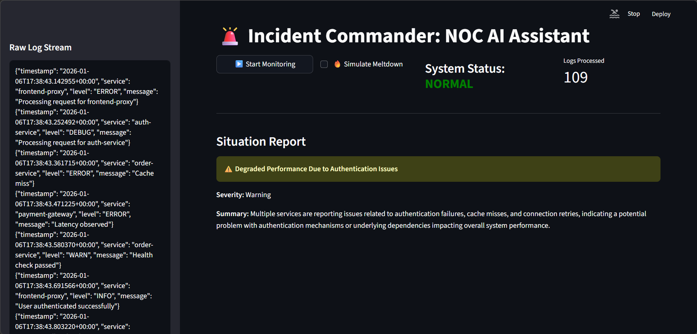
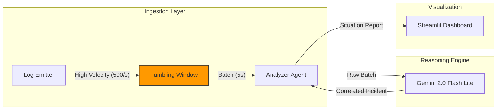

# Incident Commander: Event-Driven Log Analysis

> 🔺 **Part of the [TRINITY Project](../README.md)** - An end-to-end AI-powered Network Operations Suite


> **"Noise-Canceling" for DevOps.** An asynchronous log processor that uses Tumbling Windows to condense high-velocity error streams into actionable Situation Reports in real-time.

## ⚡ The Problem: Alert Fatigue
Modern distributed systems generate thousands of logs per minute. When a "Meltdown" occurs (e.g., a database failure), human operators are blinded by a scrolling wall of red text, making Root Cause Analysis (RCA) slow and stressful.

## 🛡️ The Solution
**Incident Commander** sits between the raw log stream and the operator. It uses a **Tumbling Window** buffer to batch logs and a **Low-Latency LLM** (Gemini 2.0 Flash Lite) to cluster them by root cause.

**Result:** A 500-log/second error spike is compressed into a single "Critical Incident" card.

## 📸 Interface Modes

### 1. Steady State Monitoring
In normal operations, the system filters background noise. The "System Status" remains green, and only meaningful events are logged.


### 2. Incident Response Mode (The "Meltdown")
When a log spike occurs (e.g., 500 logs/sec), the **Tumbling Window** activates. Instead of flooding the screen with 3,000 raw lines, the system correlates them into a single "Critical Incident" card, achieving a **74x Noise Reduction**.


## System Architecture



## Architectural Decisions

### 1. Concurrency: asyncio vs. Threading
* **Decision:** Built the ingestion pipeline using Python's `asyncio` event loops.
* **Reasoning:** Log ingestion is I/O bound. Using async allows the system to absorb a "packet storm" (500+ logs/sec) without blocking the UI or dropping packets, which would occur with synchronous processing.

### 2. Model Selection: Gemini 2.0 Flash Lite
* **Decision:** Utilized the "Flash-Lite" variant over Pro or Ultra models.
* **Reasoning:** In observability, latency is the primary constraint. Flash Lite provides sub-second reasoning capabilities at a fraction of the cost, enabling "always-on" monitoring without blowing the budget.

### 3. Output Engineering: Pydantic Enforcement
* **Decision:** Forced the LLM to adhere to a strict `IncidentReport` schema using Pydantic.
* **Reasoning:** Downstream automation (e.g., PagerDuty integration) requires structured data. By enforcing a schema, we prevent the "hallucination" of invalid fields and ensure the UI always renders correctly.

## Tech Stack
* **Runtime:** Python 3.12+ (uv)
* **LLM:** Google Gemini 2.0 Flash Lite
* **Architecture:** Python `asyncio` (Event Loop)
* **Validation:** Pydantic
* **Frontend:** Streamlit

## ⚠️ Known Issues
**Google Generative AI SDK Deprecation:**  
The `google-generativeai` package is deprecated and support ended as of January 2025. Migration to `google-genai` is required before **June 24, 2026**. The current implementation works but will need updating. See [migration guide](https://ai.google.dev/gemini-api/docs/migrate) for details.

## Quick Start

```bash
# 1. Install dependencies
uv sync

# 2. Setup Secrets
cp .env.example .env
# Edit .env and add your GEMINI_API_KEY=...

# 3. Run the Dashboard
uv run streamlit run src/app.py
```

## Testing

```bash
# Install development dependencies
uv sync --extra dev

# Run all tests
pytest tests/

# Run with verbose output
pytest tests/ -v
```

## License

This project is licensed under the MIT License - see the [LICENSE](LICENSE) file for details.
