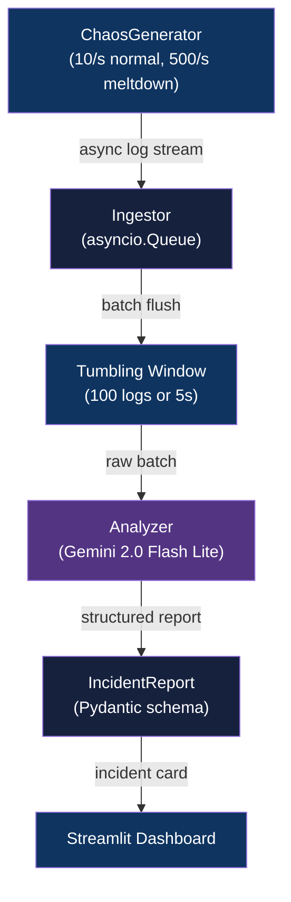
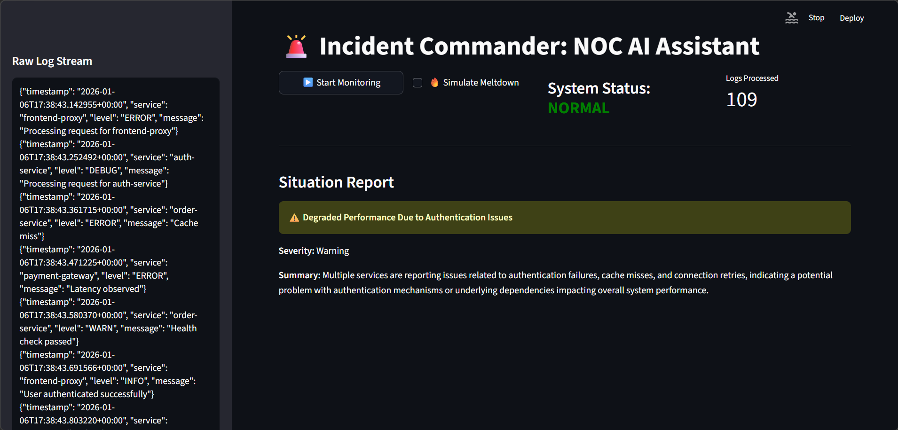
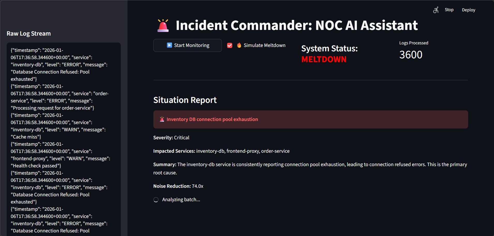

<div align="center">

# Incident Commander

[](https://www.python.org/downloads/)
[](LICENSE)

**Async log analyzer that condenses high-velocity error streams into structured incident reports using Gemini 2.0 Flash Lite and tumbling-window batching.**

[Getting Started](#getting-started) | [Usage](#usage) | [Architecture](#architecture)

</div>

---

## Table of Contents

- [Features](#features)
- [Tech Stack](#tech-stack)
- [The Problem](#the-problem)
- [Architecture](#architecture)
- [Demo](#demo)
- [Getting Started](#getting-started)
  - [Prerequisites](#prerequisites)
  - [Installation](#installation)
  - [Configuration](#configuration)
- [Usage](#usage)
- [Architectural Decisions](#architectural-decisions)
- [Project Structure](#project-structure)
- [Testing](#testing)
- [Known Issues](#known-issues)
- [Related Projects](#related-projects)
- [License](#license)
- [Author](#author)

## The Problem

### Alert Fatigue in Modern Distributed Systems

Distributed systems emit thousands of log lines per minute. During a failure event, operators face a wall of scrolling errors that obscures root cause and delays response. Manual triage at 500 logs/second is not viable.

### The Solution

Incident Commander buffers raw log events in a tumbling window (100 logs or 5 seconds, whichever triggers first), then submits each batch to Gemini 2.0 Flash Lite for root-cause clustering. The output is a single structured `IncidentReport` with severity, impacted services, and a noise reduction ratio - collapsing 3,000 raw lines into one actionable incident card.

## Features

- **Tumbling-window batching** - collects up to 100 logs or flushes every 5 seconds to Gemini for analysis
- **Pydantic-enforced incident schema** - `IncidentReport` with title, severity, impacted services, summary, and noise reduction ratio
- **Meltdown simulation mode** - toggles `ChaosGenerator` to burst 500 logs/second from `inventory-db` to test the pipeline under load
- **Streamlit live dashboard** - real-time sidebar log stream and incident cards, normal (green) and meltdown (red) status indicators
- **Async event loop throughout** - `asyncio.Queue` pipeline between `ChaosGenerator`, `Ingestor`, `Analyzer`, and the UI with no blocking calls

## Tech Stack

| Component | Technology |
|-----------|------------|
| Language | Python 3.12+ |
| LLM | Gemini 2.0 Flash Lite (`google-generativeai`) |
| Async runtime | `asyncio` event loop |
| Schema validation | Pydantic 2 |
| Dashboard | Streamlit |
| Package manager | uv |

## Architecture


```mermaid
graph TD
    CG["ChaosGenerator\n(10/s normal, 500/s meltdown)"]
    IN["Ingestor\n(asyncio.Queue)"]
    TW["Tumbling Window\n(100 logs or 5s)"]
    AZ["Analyzer\n(Gemini 2.0 Flash Lite)"]
    IR["IncidentReport\n(Pydantic schema)"]
    UI["Streamlit Dashboard"]

    CG -->|"async log stream"| IN
    IN -->|"batch flush"| TW
    TW -->|"raw batch"| AZ
    AZ -->|"structured report"| IR
    IR -->|"incident card"| UI

    style CG fill:#0f3460,color:#fff
    style IN fill:#16213e,color:#fff
    style TW fill:#0f3460,color:#fff
    style AZ fill:#533483,color:#fff
    style IR fill:#16213e,color:#fff
    style UI fill:#0f3460,color:#fff
```

## Demo

| Mode | Screenshot |
|------|------------|
| Steady-state monitoring |  |
| Meltdown (500 logs/s) |  |

## Getting Started

### Prerequisites

- Python 3.12+
- [uv](https://github.com/astral-sh/uv) package manager
- Google Gemini API key (obtain from [Google AI Studio](https://aistudio.google.com/))

### Installation

1. Clone the repository:
   ```bash
   git clone https://github.com/adityonugrohoid/incident-commander.git
   cd incident-commander
   ```

2. Install dependencies:
   ```bash
   uv sync
   ```

### Configuration

```bash
cp .env.example .env
```

Edit `.env` with your key:

<details>
<summary>Full configuration reference</summary>

```bash
# -- Required -------------------------------------------
GEMINI_API_KEY=your_gemini_api_key_here
```

</details>

## Usage

Start the Streamlit dashboard:

```bash
uv run streamlit run src/app.py
```

Once the app loads in your browser:

1. Click "Start Monitoring" to begin the async log pipeline in normal mode (10 logs/second).
2. Check "Simulate Meltdown" to burst the generator to 500 logs/second and trigger the tumbling-window analyzer.
3. Watch incident cards appear in the "Situation Report" panel, each one condensing an entire batch into a single `IncidentReport`.

## Architectural Decisions

### 1. Concurrency: asyncio over threading

**Decision:** Built the ingestion pipeline on Python's `asyncio` event loop throughout (`ChaosGenerator`, `Ingestor`, `Analyzer`).

**Reasoning:** Log ingestion is I/O-bound. `asyncio` absorbs packet storms (500+ logs/second) without blocking the Streamlit UI or dropping events. Threading would require lock coordination across the producer-consumer boundary and complicates Streamlit's single-thread render model.

### 2. Model selection: Gemini 2.0 Flash Lite

**Decision:** Flash Lite rather than Pro or Ultra variants.

**Reasoning:** Observability workloads are latency-constrained, not accuracy-constrained. Flash Lite delivers sub-second reasoning at a fraction of the cost, making always-on batch analysis viable. Higher-tier models would exceed the response budget per 5-second window.

### 3. Output contract: Pydantic `IncidentReport` schema

**Decision:** Forced LLM output to conform to a strict `IncidentReport` Pydantic model via JSON response MIME type.

**Reasoning:** Downstream automation (alerting, PagerDuty integration) requires deterministic field names and types. Pydantic validation catches hallucinated fields at parse time rather than silently propagating invalid data to the UI.

## Project Structure

```
incident-commander/
├── src/
│   ├── app.py                     # Streamlit dashboard and async monitoring loop
│   ├── agent.py                   # Analyzer class + IncidentReport Pydantic model
│   ├── ingestor.py                # Tumbling-window batch consumer (asyncio.Queue)
│   └── generators.py              # ChaosGenerator: normal + meltdown log streams
│
├── tests/
│   ├── test_agent.py              # Analyzer unit tests (mocked Gemini responses)
│   ├── test_generators.py         # ChaosGenerator output format tests
│   └── test_ingestor.py           # Ingestor batching and flush behavior tests
│
├── assets/
│   ├── normal_screenshot.png      # Dashboard in steady-state mode
│   └── meltdown_screenshot.png    # Dashboard during meltdown simulation
│
├── .env.example                   # Configuration template
├── pyproject.toml                 # uv project manifest
└── main.py                        # Placeholder entry point
```

## Testing

```bash
# Install development dependencies
uv sync --extra dev

# Run all tests
uv run pytest tests/ -v

# Run a specific module
uv run pytest tests/test_agent.py -v
```

## Known Issues

| Issue | Impact | Workaround |
|-------|--------|------------|
| `google-generativeai` SDK deprecated (Jan 2025, support ends Jun 2026) | Medium - will break after Jun 24, 2026 | Migrate to `google-genai`; see the [migration guide](https://ai.google.dev/gemini-api/docs/migrate) |

## Related Projects

| Project | Description |
|---------|-------------|
| [noc-oracle](https://github.com/adityonugrohoid/noc-oracle) | Network health Q&A over structured telemetry using Gemini |
| [net-ops-agent](https://github.com/adityonugrohoid/net-ops-agent) | Autonomous network operations agent for fault triage and remediation |

## License

This project is licensed under the [MIT License](LICENSE).

## Author

**Adityo Nugroho** ([@adityonugrohoid](https://github.com/adityonugrohoid))
